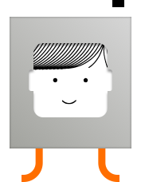

# Little Printers Web Client

<p align="center">
  
</p>

<p align="center">
  A fast, static web interface for sending text, images and drawings to a real Little Printer through a Nord Projects/Sirius Print Key.
</p>

> [!NOTE]
> This is an independent, unofficial web client inspired by the original Little Printer interface. It is not affiliated with BERG or Nord Projects.

## Overview

The application runs entirely in the browser and can be hosted on GitHub Pages. It renders the complete receipt at the printer's real thermal width, converts it to a PNG and sends it directly to the Print Key API.

No account, database or application server is required for immediate printing.

## Features

- Connect to a real Little Printer using its HTTPS Print Key URL.
- Check the printer name and online status.
- Add the sender name shown in the receipt header.
- Create mixed receipts with title, message and image.
- Upload PNG, JPEG or GIF images up to 10 MB.
- Preview the receipt at the real 384-dot thermal width.
- High-quality monochrome image processing with three modes:
  - **PHOTO HQ** — auto-levels, high-quality resizing and serpentine Floyd–Steinberg dithering.
  - **Atkinson** — lighter retro diffusion suitable for illustrations.
  - **Threshold** — sharp black-and-white conversion for logos and line art.
- Draw directly on a Quickdraw canvas and print the result.
- Use a branded header with the Little Printer face, live date/time, sender name and Miniutti logo.
- Prepare scheduled jobs locally for a future server-side scheduler.
- Responsive interface designed in the visual language of the original Little Printer app.

## How real printing works

1. **Connect** sends a `GET` request to the Print Key URL with `Accept: application/json`.
2. The app reads the printer name and status returned by Sirius.
3. The receipt is rendered in the browser on a 384 px canvas, including header, title, text, processed image or drawing.
4. The exact preview is exported as a PNG.
5. The PNG binary is sent with a `POST` request using `Content-Type: image/png`.
6. The sender name is included as `?from=SenderName`.
7. Printing is considered successful only when the server returns `{ "status": "sent" }`.

The preview is therefore the actual bitmap sent to the printer, not a separate visual approximation.

## Requirements

- A Little Printer connected to a compatible Nord Projects Sirius server.
- A valid Print Key URL, normally in this form:

  ```text
  https://your-sirius-server.example/printkey/YOUR_PRINT_KEY
  ```

- HTTPS when the page is hosted over HTTPS.
- CORS enabled on the Print Key endpoint. The standard Sirius `/printkey/*` route supports browser requests.
- A modern browser with Canvas, Fetch, FileReader and localStorage support.

## Deploy on GitHub Pages

### 1. Create the repository

Create a new GitHub repository and upload all files contained in the `github-pages` folder, preserving this structure:

```text
repository-root/
├── index.html
├── v2.css
├── v2.js
├── README.md
└── assets/
    ├── little-printer.png
    ├── little-printer-original-3x.png
    ├── miniutti-logo.png
    ├── BebasNeueWhatever.woff
    ├── LICENSE-NORD
    └── ...
```

Do not upload only `index.html`: the `assets` directory and the CSS/JavaScript files are required.

### 2. Enable GitHub Pages

In the repository:

1. Open **Settings → Pages**.
2. Under **Build and deployment**, choose **Deploy from a branch**.
3. Select branch **main** and directory **/ (root)**.
4. Click **Save**.
5. Wait for GitHub to publish the site.

The public address will normally be:

```text
https://YOUR-USERNAME.github.io/YOUR-REPOSITORY/
```

### 3. Optional custom domain

You can configure your own domain in **Settings → Pages → Custom domain**. Keep HTTPS enabled so the browser can securely contact an HTTPS Print Key.

## Usage

### Connect the printer

1. Open the web app.
2. Paste the complete Print Key URL.
3. Enter the sender name in **FROM**.
4. Press **Connect**.
5. Confirm that the correct printer name and online status are shown.

The Print Key is kept only in the current page session and is not stored in localStorage.

### Create and print a receipt

1. Open **CREATE**.
2. Add an optional title.
3. Write the message.
4. Optionally upload an image and select its processing mode.
5. Check the thermal preview and estimated receipt length.
6. Press **Print** to send the rendered PNG to the connected printer.

### Draw and print

1. Open **DRAW**.
2. Draw on the Quickdraw canvas.
3. Clear or edit the drawing if needed.
4. Check the preview and press **Print**.

## Image quality

Little Printer has a physical resolution of 384 dots across and prints only black or white. Continuous grey tones cannot be reproduced directly, so photographs are converted into dot patterns.

For the best result:

- Start with a sharp, high-resolution image.
- Prefer good contrast and a simple background.
- Crop the important subject before uploading.
- Use **PHOTO HQ** for photographs.
- Use **Atkinson** for softer illustrations.
- Use **Threshold** for logos, text and line drawings.
- Remember that a higher-resolution source improves resampling, but cannot exceed the printer's physical 384-dot width.

Animated GIFs are accepted as image files but are printed as a still frame.

## Receipt header

The header is included inside the bitmap sent to the printer:

- Original Little Printer face on the left.
- Current date and time in the centre.
- Sender name below the date/time.
- Miniutti logo on the right.

Because the header is rasterized with the receipt, its layout is consistent in the preview and on paper.

## Print Key API compatibility

### Status request

```http
GET /printkey/YOUR_PRINT_KEY
Accept: application/json
```

Expected JSON fields include:

```json
{
  "name": "My Little Printer",
  "status": "online"
}
```

### Print request

```http
POST /printkey/YOUR_PRINT_KEY?from=SenderName
Content-Type: image/png
Accept: application/json

<PNG binary>
```

Expected successful response:

```json
{
  "status": "sent"
}
```

If your server uses a different endpoint, authentication method, payload or response format, adapt the connection and submission functions in `v2.js`.

## Scheduled prints

Scheduled jobs can be prepared and saved in the browser, but GitHub Pages cannot execute them after the page is closed because it is a static hosting service.

The local queue stores the sender and already-rendered receipt PNG in localStorage. Jobs remain marked as waiting for a future server connector. Reliable automatic printing will require a small always-on backend or automation service that:

1. Stores the jobs securely.
2. Wakes up at the selected time.
3. Sends the PNG to the Print Key.
4. Records success or failure.

Do not rely on the browser queue for unattended printing in this version.

## Security and privacy

- Messages and images are processed locally in the browser before printing.
- There are no analytics, user accounts or application database.
- The Print Key acts like a secret: anyone who has it may be able to print.
- Do not commit a real Print Key to the repository or include it in screenshots.
- Use HTTPS and keep the Sirius server updated and access-controlled.
- Scheduled receipt images remain in the browser's localStorage until removed.
- On a shared computer, clear the queue and close the page after use.

## Technical limits

| Item | Limit |
|---|---:|
| Thermal print width | 384 px |
| Maximum rendered receipt height | 1400 px |
| Uploaded image size | 10 MB |
| Title length | 48 characters |
| Message length | 800 characters |
| Sender name length | 40 characters |
| Locally scheduled jobs | 8 |

Long content may be shortened or constrained by the maximum receipt height. Always inspect the preview before printing.

## Project structure

```text
github-pages/
├── index.html       # Application markup
├── v2.css           # Interface, responsive layout and print preview styles
├── v2.js            # Connection, rendering, image processing, drawing and printing
├── README.md        # Project documentation
└── assets/          # Fonts, interface graphics, logos and third-party license
```

## Customization

- Replace `assets/miniutti-logo.png` to change the right-side header logo.
- Keep replacement logos transparent and simple for clean monochrome conversion.
- Edit colors, spacing and responsive rules in `v2.css`.
- Edit canvas layout, typography and image algorithms in `v2.js`.
- Preserve the 384 px receipt width unless targeting a different printer model.

## Troubleshooting

| Problem | What to check |
|---|---|
| **Connect does nothing or shows an error** | Confirm the complete Print Key URL, HTTPS, internet connection and CORS configuration. |
| **Printer appears offline** | Check that the printer is powered, connected to the bridge/server and reported online by Sirius. |
| **Browser reports “Failed to fetch”** | This is commonly an invalid certificate, mixed HTTP/HTTPS content, unreachable server or missing CORS headers. |
| **Print request fails** | Inspect the server response and confirm that the endpoint accepts a raw `image/png` POST. |
| **Receipt prints but the sender is missing** | Confirm that the FROM field is filled and that the server supports the `from` query parameter. |
| **Image is grainy** | Use a sharper original and PHOTO HQ. Some dot texture is unavoidable on a 1-bit thermal printer. |
| **Image is too dark or light** | Try Atkinson or Threshold and choose an image with stronger contrast. |
| **Scheduled print does not run** | Expected on GitHub Pages: scheduling currently needs the future server connector. |
| **Logo or font is missing** | Verify that the complete `assets` directory was uploaded with the same filenames and capitalization. |

## Local development

No build step is required for the GitHub Pages version. From the project directory, start any static HTTP server, for example:

```bash
python3 -m http.server 8080 --directory github-pages
```

Then open:

```text
http://localhost:8080
```

Using an HTTP server is recommended because browser security rules can behave differently when `index.html` is opened directly from the filesystem.

## Credits

- Little Printer was originally created by [BERG](http://bergcloud.com/).
- Interface assets and the **Bebas Neue Whatever** font are sourced from the Apache-2.0-licensed [Nord Projects Little Printers iOS app](https://github.com/nordprojects/littleprinters-ios-app).
- Real printing is designed for the [Nord Projects Sirius server](https://github.com/nordprojects/sirius).
- The relevant third-party license is included in `assets/LICENSE-NORD`.

## License

The Nord Projects assets included in this repository remain subject to the Apache License 2.0 supplied in `assets/LICENSE-NORD`.

The Miniutti mark remains the property of its owner. Unless a separate root `LICENSE` file is added, the original application code is not automatically granted an open-source license and remains protected by default copyright.

Before accepting external contributions or encouraging reuse, add a root license that reflects how you want the application code to be used.

## Disclaimer

This software is provided without warranty. Test with non-sensitive content first. Printing depends on the availability and configuration of your browser, network, Sirius server and Little Printer hardware.
